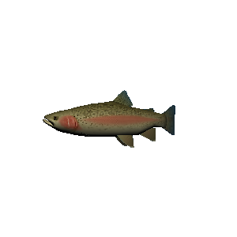

# SyntheticImageRenderer
A synthetic image renderer made with Ogre

The code in main generates these files, without opening any windows:

  

To change the configuration for any image use:
```c++
std::default_random_engine generator(42);
ProcessConfigurator configurator;
configurator.imagesConfigurations.emplace_back(SingleImageConfiguration {
    .inputMesh = "../fish.mesh", //path to mesh
    .outputPath = "../rendered.png", //image name
    .width = 250, //image width
    .height = 250, //image height
    .randomnessProviderPosition = [&generator] (const Ogre::Vector3& point) { 
        // Provides a random variation on a point
        // This is for moving the camera a bit
        std::normal_distribution<Ogre::Real> distributionX(point.x, 25.0);
        std::normal_distribution<Ogre::Real> distributionY(point.y, 5.0);
        std::normal_distribution<Ogre::Real> distributionZ(point.z, 5.0);
        return Ogre::Vector3(
            distributionX(generator),
            distributionY(generator),
            distributionZ(generator)
        );
    },
    .randomnessProviderRotation = [&generator] () {
        // Provides a random rotation for the camera
        std::normal_distribution<Ogre::Real> distributionAngle(0, 10);
        return Ogre::Degree(distributionAngle(generator));
    },
    .postProcessing = [] (cv::Mat& image) {
    	// Images have transparent backgrounds,
    	// and allow for little customization,
    	// use this if you want to change the result
        cv::Mat mask;
        inRange(image, cv::Scalar(0, 0, 0, 0), cv::Scalar(255, 255, 255, 0), mask);
        image.setTo(cv::Scalar(0, 0, 0, 255), mask);
        return image;
    },
});
```